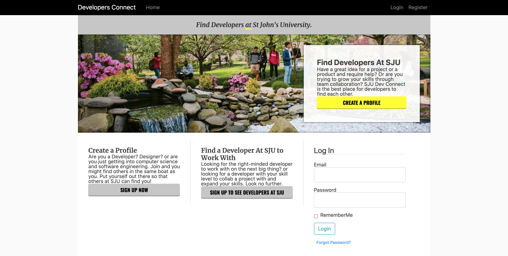
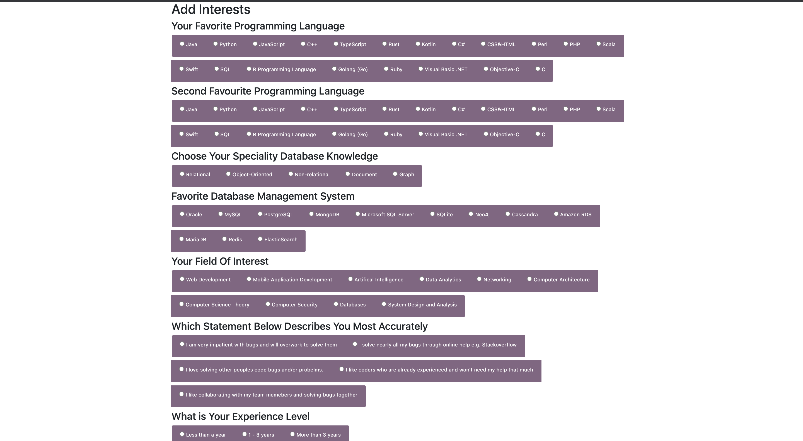
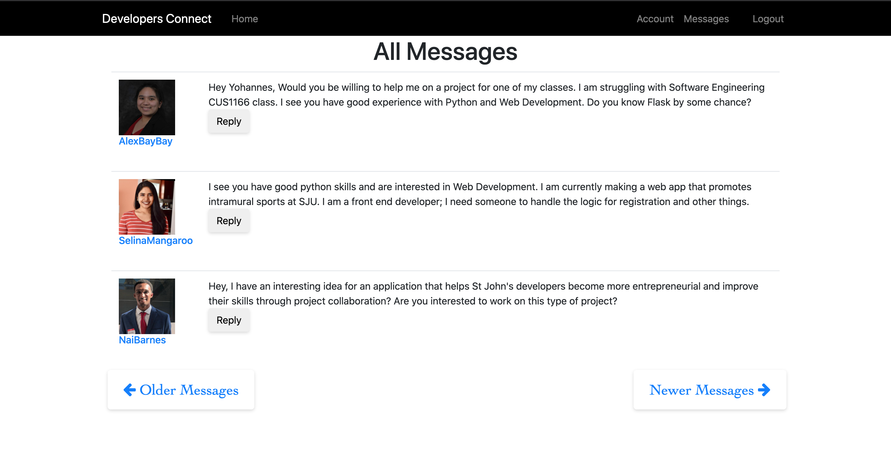

# Developer Connect

# This same project using React is available under my other branch. If you are interested in that check that out. It works the same. This branch uses Flask's template engine Jinja2 and render_template.

## Portfolio

A social networking platform built specifically for St. John's University student developers to find project collaborators and grow their skills. Features include user profiles with skill listings, project posting capabilities, and private messaging for direct communication between developers.

Built with Flask, PostgreSQL, and vanilla JavaScript (with a React version available in a separate branch). The platform addresses the challenge of connecting a smaller developer community on campus, enabling students to find teammates for projects, share knowledge, and build real-world applications together. Includes full authentication, profile management, and real-time messaging capabilities.

Are you a student at SJU? Do you have a great idea for a project or a product and require help? 

Or are you trying to grow your skills through project collaboration? SJU Dev Connect is the best place for developers to find each other.

Developers/Users can 

* View other developers profile to see if they are fit for eachother, or have the qualities they are looking for. 
* Private Message other developers for questions, collaboration in projects, and in general, just to communicate with each other.
* Edit their profile and account any time.

Dev-Connect was created to encourage entrepreneurship and development of programming skills through real word projects built with other students that have similar or varied skills at St John's University. The number of computer science students at SJU isn't that high compared to other majors. This project had the sole goal of connecting developers together at a campus with not many developers.

This project was developed using Python, Flask, SQLite and JS.
